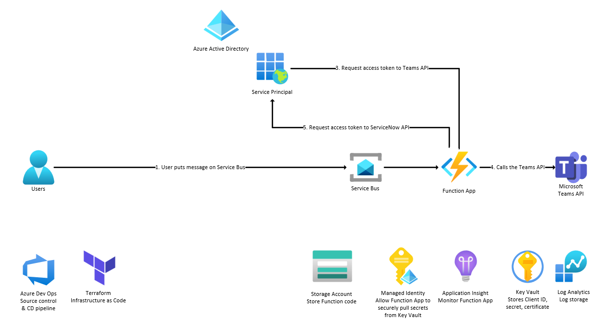

# template-repository



## Disclaimer

**THE SOFTWARE IS PROVIDED "AS IS", WITHOUT WARRANTY OF ANY KIND, EXPRESS OR IMPLIED, INCLUDING BUT NOT LIMITED TO THE WARRANTIES OF MERCHANTABILITY, FITNESS FOR A PARTICULAR PURPOSE AND NONINFRINGEMENT. IN NO EVENT SHALL THE AUTHORS OR COPYRIGHT HOLDERS BE LIABLE FOR ANY CLAIM, DAMAGES OR OTHER LIABILITY, WHETHER IN AN ACTION OF CONTRACT, TORT OR OTHERWISE, ARISING FROM, OUT OF OR IN CONNECTION WITH THE SOFTWARE OR THE USE OR OTHER DEALINGS IN THE SOFTWARE.**

## Prerequisites

- [Azure CLI](https://docs.microsoft.com/en-us/cli/azure/install-azure-cli)
- Azure subscription & resource group

## Deployment

1.  Modify the `infra/env/dev.tfvars` file to match your environment

1.  Initialize Terraform locally

    ```shell
    terraform init
    ```

1.  Format the Terraform code

    ```shell
    terraform fmt
    ```

1.  Create a Terraform plan

    ```shell
    terraform plan --var-file ./env/dev.tfvars
    ```

1.  Apply the Terraform plan

    ```shell
    terraform apply --var-file ./env/dev.tfvars
    ```

## Links
