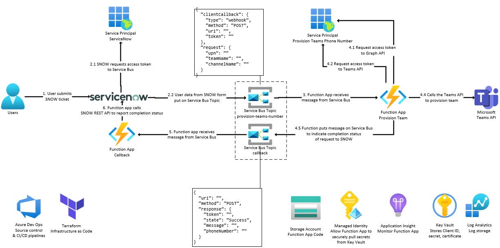

# template-repository



## Disclaimer

**THE SOFTWARE IS PROVIDED "AS IS", WITHOUT WARRANTY OF ANY KIND, EXPRESS OR IMPLIED, INCLUDING BUT NOT LIMITED TO THE WARRANTIES OF MERCHANTABILITY, FITNESS FOR A PARTICULAR PURPOSE AND NONINFRINGEMENT. IN NO EVENT SHALL THE AUTHORS OR COPYRIGHT HOLDERS BE LIABLE FOR ANY CLAIM, DAMAGES OR OTHER LIABILITY, WHETHER IN AN ACTION OF CONTRACT, TORT OR OTHERWISE, ARISING FROM, OUT OF OR IN CONNECTION WITH THE SOFTWARE OR THE USE OR OTHER DEALINGS IN THE SOFTWARE.**

## Prerequisites

- [Azure CLI](https://docs.microsoft.com/en-us/cli/azure/install-azure-cli)
- Azure subscription & resource group

## Deployment

1.  Modify the `infra/env/dev.tfvars` file to match your environment

1.  Initialize Terraform locally

    ```shell
    terraform init
    ```

1.  Format the Terraform code

    ```shell
    terraform fmt
    ```

1.  Create a Terraform plan

    ```shell
    terraform plan --var-file ./env/dev.tfvars
    ```

1.  Apply the Terraform plan

    ```shell
    terraform apply --var-file ./env/dev.tfvars
    ```

1.  Deploy the Azure Function App

    ```shell
    func azure functionapp publish func-funcSbTeams-ussc-dev
    ```

## Testing

1.  Put a message on the queue

    ```shell
    curl -X POST -H "Content-Type: application/json" -H "Authorization: SharedAccessSignature ..." -d '{ "UserPrincipalName": "dwight.k.schrute@dunder-mifflin.com", "TeamName": "PowerShellCreatedTeam", "ChannelName": "PowerShellCreatedChannel"}' https://sb-funcsbteams-ussc-dev.servicebus.windows.net/provision-teams-did/messages
    ```

## Run locally

1.  Update the `local.settings.json` file to match your environment

1.  Run locally

    ```shell
    func start
    ```

## Debug locally

1.  Add the following line to the PowerShell script

    ```powershell
    Wait-Debugger
    ```

1.  Start the script

    ```shell
    func start
    ```

1.  Find the process ID

    ```shell
    Get-PSHostProcessInfo
    ```

1.  Look for the `dotnet` process name.

    ```shell
    ProcessName ProcessId AppDomainName
    ----------- --------- -------------
    dotnet          49988 None
    pwsh            43796 None
    pwsh            49970 None
    pwsh             3533 None
    pwsh            79544 None
    pwsh            34881 None
    pwsh            32071 None
    pwsh            88785 None
    ```

1.  Run the following commands to attach the debugger

    ```shell
    $pid = 49988
    Enter-PSHostProcess -Id $pid

    Debug-Runspace 1
    ```

## Links
